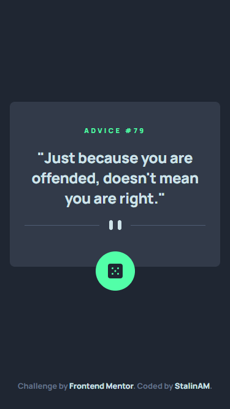

# Frontend Mentor - Advice generator app solution

This is a solution to the [Advice generator app challenge on Frontend Mentor](https://www.frontendmentor.io/challenges/advice-generator-app-QdUG-13db). Frontend Mentor challenges help you improve your coding skills by building realistic projects.

## Table of contents

- [Frontend Mentor - Advice generator app solution](#frontend-mentor---advice-generator-app-solution)
  - [Table of contents](#table-of-contents)
  - [Overview](#overview)
    - [The challenge](#the-challenge)
    - [Screenshot](#screenshot)
    - [Links](#links)
  - [My process](#my-process)
    - [Built with](#built-with)
    - [What I learned](#what-i-learned)
  - [Author](#author)

## Overview

### The challenge

Users should be able to:

- View the optimal layout for the app depending on their device's screen size
- See hover states for all interactive elements on the page
- Generate a new piece of advice by clicking the dice icon

### Screenshot

Mobile version



Desktop version


### Links

- Solution URL: [GitHub](https://github.com/StalinAM/adviceGeneratorApp.git)
- Live Site URL: [StalinAM](https://stalinam.github.io/adviceGeneratorApp/)

## My process

### Built with

- Semantic HTML5 markup
- CSS custom properties
- Flexbox
- Mobile-first workflow
- [React](https://reactjs.org/)
- [Vite](https://vitejs.dev/)
- [Advice Slip JSON API](https://api.adviceslip.com/)

### What I learned

Using the Fetch API

```js
const [index, setIndex] = useState([]);
  const [advice, setAdvice] = useState([]);
  async function loadData() {
    const response = await fetch("https://api.adviceslip.com/advice");
    const data = await response.json();
    setIndex(data.slip.id);
    setAdvice(data.slip.advice);
  }
  useEffect(() => {
    loadData();
  }, []);
  const nextAdvice = () => {
    loadData();
  };
```

## Author

- GitHub - [StalinAM](https://github.com/StalinAM)
- Frontend Mentor - [@StalinAM](https://www.frontendmentor.io/profile/StalinAM)